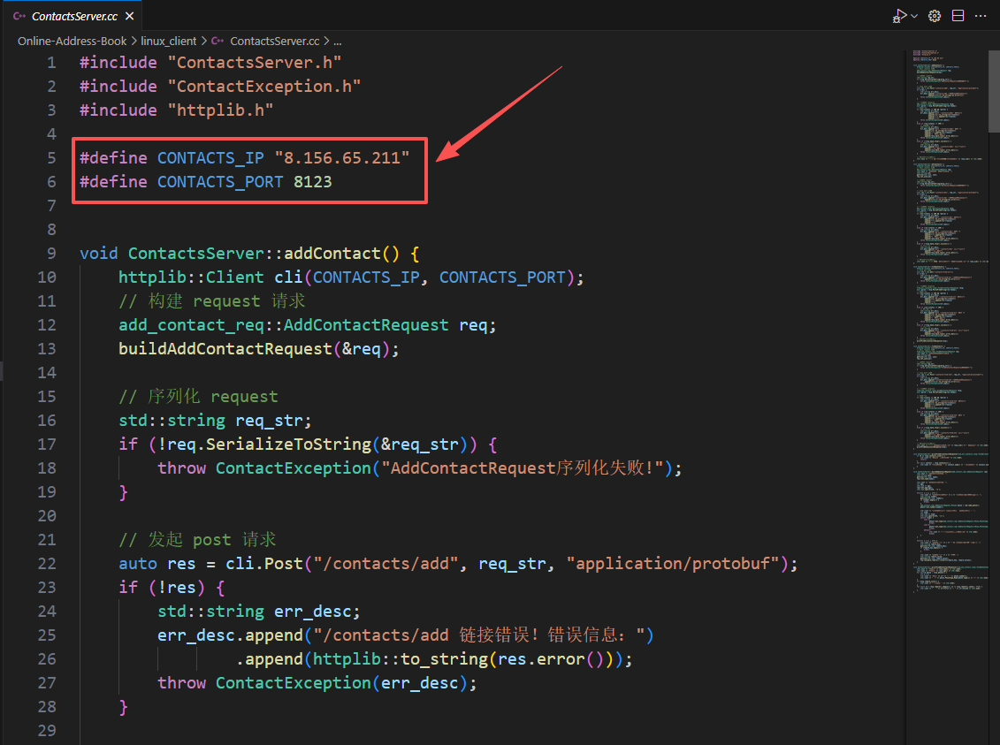
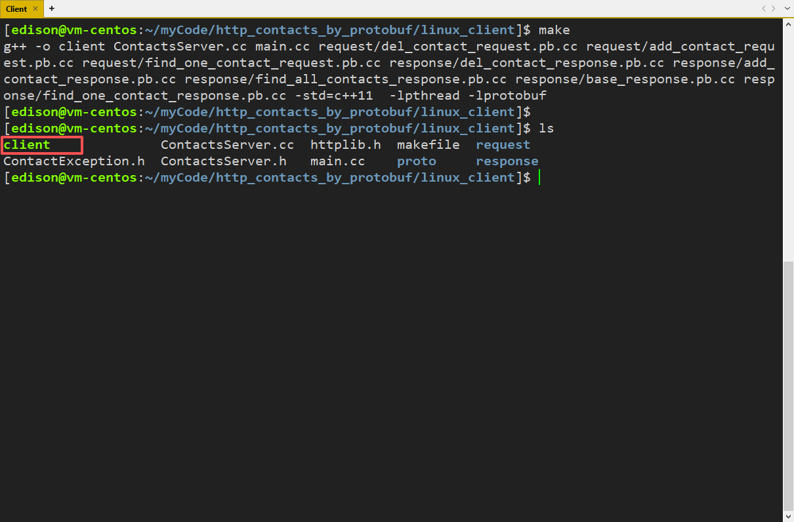
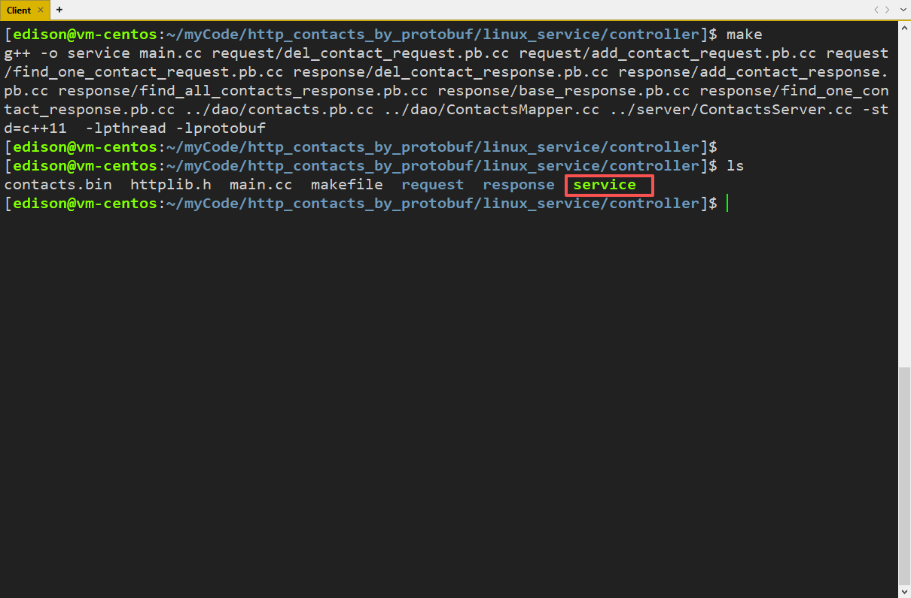

# Online-Address-Book

📞 基于 ProtoBuffer 的网络版通讯录


### 运行说明

#### 1、先把 gcc/g++ 升级到 8 版本
```bash
# 安装gcc 8版本
yum install -y devtoolset-8-gcc devtoolset-8-gcc-c++

# 启用版本
source /opt/rh/devtoolset-8/enable

# 查看版本已经变成gcc 8.3.1
gcc -v
```

如果已经升级，那么只需要启动 gcc/g++ 即可
```bash
# 启用版本
source /opt/rh/devtoolset-8/enable
```

#### 2、启动客户端

先切换到 linux_client 目录下，然后找到 `ContactsServer.cc` 文件，把文件开头的 `CONTACTS_IP` 替换成自己服务器的 IP 地址（如下图所示）



接着，在 linux_client 目录下执行 make 命令，即可编译运行成功（如下图所示）




#### 3、启动服务端

先切换到 linux_service/controller 目录下，然后执行 make 命令，即可编译运行成功（如下图所示）




### 教程文档

对于 ProtoBuffer 的系列教程，可以移步作者本人的博客文档：[ProtoBuf 的学习与使用](https://blog.csdn.net/m0_63325890/category_13117864.html)
